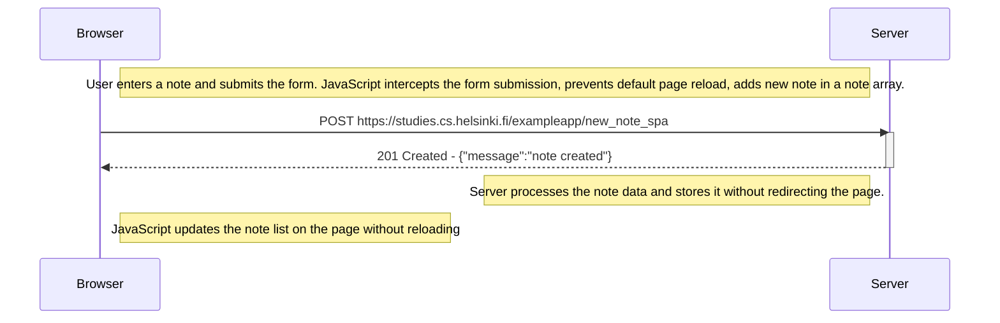

```mermaid
sequenceDiagram
    participant browser as Browser
    participant server as Server

    Note right of browser: User enters a note and submits the form. JavaScript intercepts the form submission, prevents default page reload, adds new note in a note array.
    
    browser->>server: POST https://studies.cs.helsinki.fi/exampleapp/new_note_spa
    activate server
    server-->>browser: 201 Created - {"message":"note created"}
    deactivate server
    Note left of server: Server processes the note data and stores it without redirecting the page.

    Note right of browser: JavaScript updates the note list on the page without reloading

```
